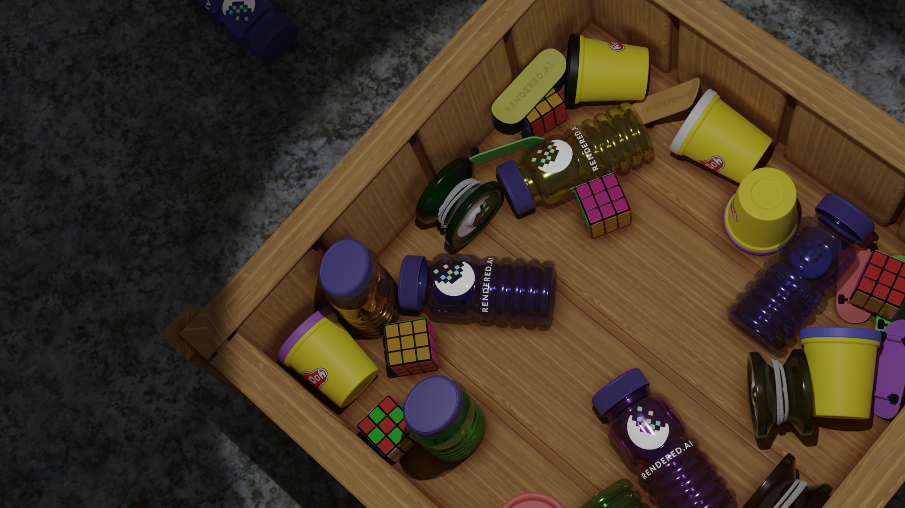

# Ana
Ana is at the heart of the Rendered.ai engine - a platform for custom channels that generate synthetic datasets.
Developers can use Ana to build and test their channel, then deploy that channel to the Rendered.ai engine
for generating datasets that can be used with your ML project.

The source code and files in this repository are copyright 2019-2022 DADoES, Inc. and licensed under the Apache 2.0
license which is located at the root level of this repository: [LICENSE](LICENSE).

## Setup
[Development Docker](https://support.rendered.ai/develop/development-docker):
Rendered.ai provides Development Docker Images that can simplify setting up your environment for channel development
and can accelerate the channel deployment process.
A development container ([VSCode extension](https://code.visualstudio.com/docs/remote/containers))
saves you the trouble of building the channel every time you want to test,
and ensures the code you are working with is the code that is in the docker when it is registered.

[Local Environment](https://support.rendered.ai/local-development):
A guide for installing the appropriate libraries for your platform
for developers who want to set up their local environment to develop a channel.

## Running Ana From the Command Line
For a single graph interpretation use:
```
blender --background --python ana.py -- --channel <channel-name> --graph <graph-file> --loglevel <log-level> \
 --data <data-dir> --output <output-dir>
```
The arguments are

* \<channel-name\>: the name of the channel
* \<graph-file\>: the name of the graph file in ./channels/\<channel-name\>/graphs/ - supported formats are JSON and YAML
* \<data-dir\>: the relative location of object model assets 
* \<output-dir\>: the relative location to write the result of the run
* \<log-level\>: the Python [logging levels](https://docs.python.org/3/library/logging.html#logging-levels)

## Running the Example Channel
All accounts at Rendered.ai come with a simplistic channel that showcase the Ana tool and some of its common libraries.
Developers can inspect the code here and see how it looks when deployed at the Rendered.ai GUI.
For example, the graph in this repository produces images of objects dropped into a container that sits on a floor.
```bash
ana/ana $ blender --background --python ana.py -- --channel example --graph example_test --loglevel INFO
```

And here is how to run the Example Channel Container
```bash
$ docker run --gpus all -v $ANA_ROOT/ana/datasets:/ana/datasets example blender --background --python ana/ana.py -- \
 --channel example --graph ana/channels/example/graphs/example_test.yml --data /data --output /ana/datasets
```

Once ran, an output folder will be created with the following directories:
```
output/
    |- annotations/
    |- images/
    |- masks/
    |- metadata/
```

The image below is an example of what you'll find in the images/ directory.


The available graphs for the channel are located in \<ana-root\>/ana/channels/example/graphs.

| graph | description |
|---|---|
| example_test | A simple test graph that drops some toys into a wooden box. |

## Additional Resources
[Development Docker](https://support.rendered.ai/develop/development-docker) <br />
[Setting up your Local Environment](https://support.rendered.ai/local-development) <br />
[Ana Software Architecture](https://support.rendered.ai/ana-architecture) <br />
[Creating a Channel](https://support.rendered.ai/create-channel) <br />
[Deploying a Channel](https://support.rendered.ai/deploy-channel) <br />
[Adding Objects to a Channel](https://support.rendered.ai/channel-objects) <br />
[Modifying Objects in a Channel](https://support.rendered.ai/channel-modifiers) <br />
[Adding Sensors to a Channel](https://support.rendered.ai/channel-sensors) <br />
[Managing Content with Volumes](https://support.rendered.ai/volumes) <br />
